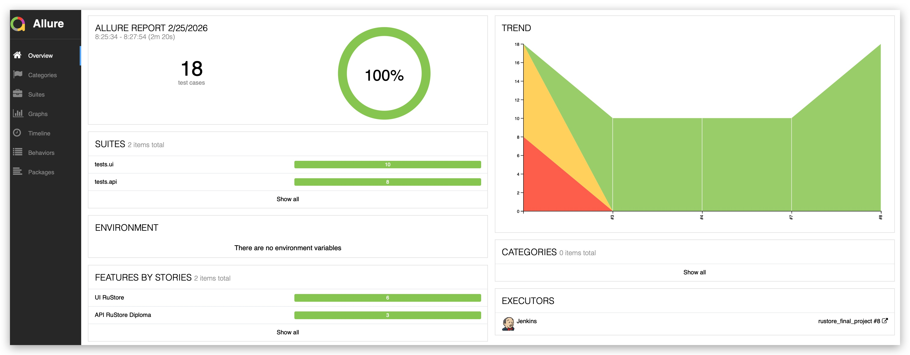
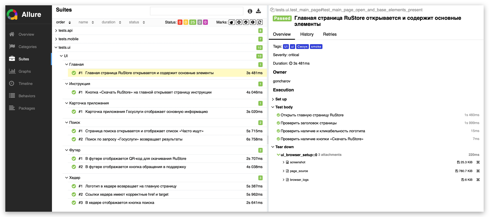

# Дипломный QA проект: UI + API + Mobile Automation

<p align="center">
  <a href="#-технологический-стек">
    
  </a>
  <a href="#-технологический-стек">
    
  </a>
  <a href="#-ui-web-rustore">
    
  </a>
  <a href="#-ui-web-rustore">
    
  </a>
  <a href="#-api-fakestoreapi">
    
  </a>
  <a href="#-отчетность-и-интеграции">
    
  </a>
  <a href="#-mobile-wikipedia-apk">
    
  </a>
  <a href="#-ui-web-rustore">
    
  </a>
  <a href="#-mobile-wikipedia-apk">
    
  </a>
  <a href="#-ci-jenkins">
    
  </a>
  <a href="#-отчетность-и-интеграции">
    
  </a>
  <a href="#-отчетность-и-интеграции">
    
  </a>
</p>

<p align="center">
  
  
  
  
</p>

---

## Содержание

- [О проекте](#о-проекте)
- [Технологический стек](#технологический-стек)
- [Покрытие и блоки тестирования](#покрытие-и-блоки-тестирования)
- [Архитектура проекта](#архитектура-проекта)
- [Быстрый старт](#быстрый-старт)
- [Запуск тестов](#запуск-тестов)
- [Отчетность и интеграции](#отчетность-и-интеграции)
- [Сценарий защиты диплома](#сценарий-защиты-диплома)
- [Roadmap](#roadmap)

---

## О проекте

Этот репозиторий объединяет три части дипломной работы по автоматизации тестирования:

1. **UI (Web):** тестирование [RuStore](https://www.rustore.ru/)
2. **API:** тестирование [FakeStore API](https://fakestoreapi.com/docs)
3. **Mobile:** тестирование **Wikipedia APK** через Appium

Проект оформлен как единая QA-система с:
- единым стилем Allure-разметки
- автоприложениями (attachments) в отчетах
- запуском по слоям (`ui`, `api`, `mobile`)
- готовностью к CI/CD и отчетам в TestOps

---

## Технологический стек

- **Python 3.10+**
- **Pytest**
- **Selene + Selenium** (UI)
- **Requests + JSON Schema + Pydantic** (API)
- **Appium + UiAutomator2** (Mobile)
- **Allure Report / Allure TestOps**
- **Jenkins**
- **Jira**
- **Telegram notifications**

---

## Покрытие и блоки тестирования

### UI (Web, RuStore)

- `tests/ui/test_main_page.py`
- `tests/ui/test_header_navigation.py`
- `tests/ui/test_search.py`
- `tests/ui/test_instruction_page.py`
- `tests/ui/test_footer.py`
- `tests/ui/test_app_page.py`

Что проверяется:
- главная страница и базовые элементы
- хедер и навигация
- поиск и результаты
- карточка приложения
- переход на инструкцию скачивания
- элементы футера

### API (FakeStore API)

- `tests/api/test_products_api.py`
- `tests/api/test_users_api.py`
- `tests/api/test_carts_api.py`

Что проверяется:
- методы **GET / POST / DELETE**
- статус-коды
- бизнес-значения в ответе
- schema validation (request/response)
- endpoint-подход с базовым URI из фикстуры

### Mobile (Wikipedia APK)

- `tests/mobile/test_wikipedia_app.py`

Что проверяется:
- запуск приложения
- открытие и работа поиска
- проверка результатов
- доп. пользовательские сценарии в поиске

---

## Архитектура проекта

```text
.
├── api/
│   └── endpoints/                 # Endpoint-классы API
├── config/
│   └── mobile_config.py           # Pydantic-конфиги Mobile (local/remote)
├── media/
│   ├── icons/                     # Иконки для README
│   └── images/                    # Скриншоты отчетов и демонстрации
├── models/
│   └── api/                       # Pydantic request/response модели
├── pages/                         # UI PageObjects
├── resources/
│   └── apk/                       # APK для mobile запуска
├── schemas/
│   └── api/                       # JSON схемы API
├── tests/
│   ├── api/
│   ├── mobile/
│   └── ui/
├── pytest.ini
├── requirements.txt
└── Makefile
```

---

## Быстрый старт

### 1. Установка зависимостей

```bash
python -m venv .venv
source .venv/bin/activate
pip install -r requirements.txt
```

### 2. Проверка качества кода

```bash
make qa
```

---

## Запуск тестов

### Все тесты сразу

```bash
pytest tests --alluredir=allure-results
```

### Только UI

```bash
pytest tests/ui -m ui --alluredir=allure-results
```

### Только API

```bash
pytest tests/api -m api --alluredir=allure-results
```

### Только Mobile

```bash
pytest tests/mobile -m mobile --alluredir=allure-results
```

### Просмотр Allure-отчета

```bash
allure serve allure-results
```

---

## Параметры окружения

### UI

- `UI_BASE_URL` (default: `https://www.rustore.ru`)
- `UI_BROWSER` (default: `chrome`)
- `UI_BROWSER_WIDTH` (default: `1920`)
- `UI_BROWSER_HEIGHT` (default: `1080`)
- `SELENOID_URL` (опционально, удаленный запуск)

### API

- `API_BASE_URL` (default: `https://fakestoreapi.com`)
- `API_TIMEOUT` (default: `15`)

### Mobile

- `.env.mobile.local` — локальный запуск (эмулятор/реальный девайс)
- `MOBILE_ENV=remote` + `.env.mobile.remote` — запуск через BrowserStack (по необходимости)

---

## Отчетность и интеграции

### Allure Report

<p align="center">
  
</p>

<p align="center">
  
</p>

### TestOps / Jenkins / Telegram / Jira

Добавьте ваши финальные скриншоты в `media/images/` и раскомментируйте/обновите блоки ниже:

```md


```

### Видео мобильного прогона

```md

```

---

## Сценарий защиты диплома

Это краткий план демонстрации на защите (чтобы показать проект уверенно и последовательно):

1. Показать структуру репозитория и объяснить 3 блока: UI/API/Mobile.
2. Запустить выборочно по одному тесту из каждого блока.
3. Запустить полный прогон `pytest tests --alluredir=allure-results`.
4. Открыть Allure и показать:
   - группировки `epic/feature/story`
   - теги/лейблы/критичность
   - вложения (screenshot/page source/logs/video/url)
5. Показать интеграции: Jenkins, TestOps, Jira, Telegram.
6. Коротко объяснить архитектурные решения:
   - PageObject в UI
   - endpoint + model + schema в API
   - pydantic config + dotenv в Mobile

Этот раздел нужен именно для защиты: это не "теория", а готовый чеклист демонстрации проекта перед преподавателем.

---

## Roadmap

- Добавить автозагрузку результатов в Allure TestOps из CI
- Добавить публикацию артефактов после каждого прогона в Jenkins
- Расширить mobile-набор до негативных и сетевых сценариев
- Добавить smoke/regression пайплайны с раздельными джобами

---

