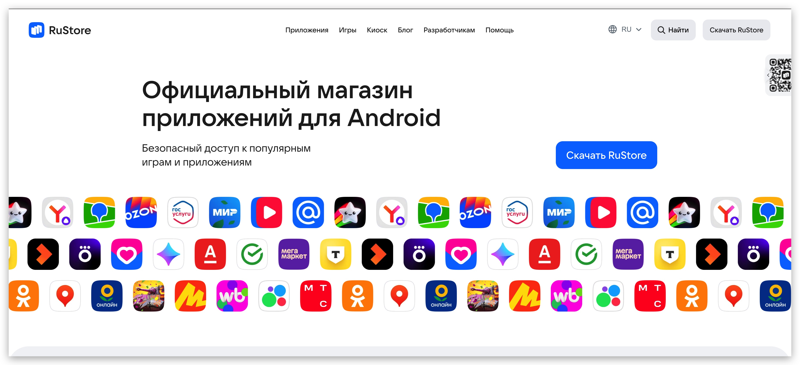
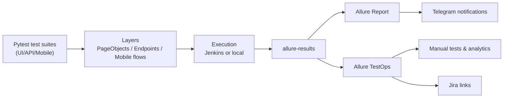
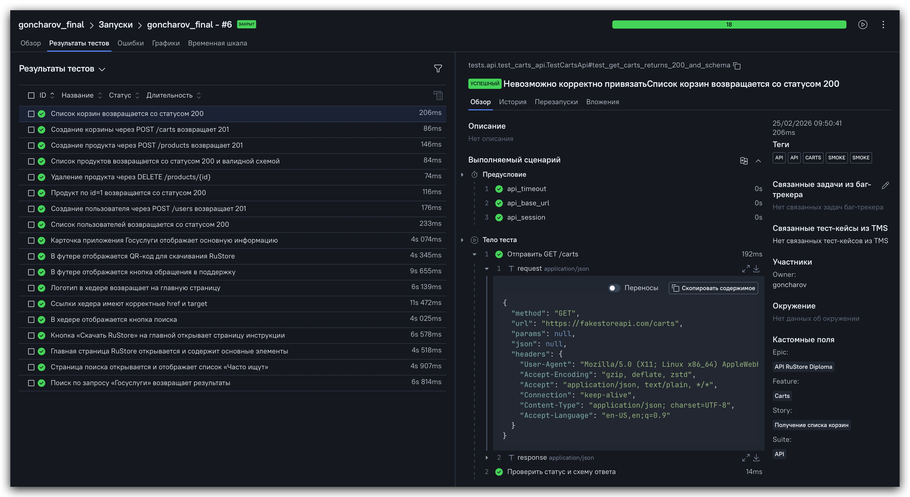
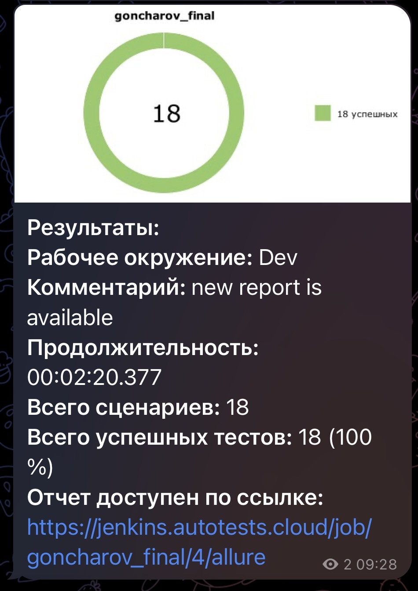

# 🧪 Дипломный QA проект: RuStore (UI + API + Mobile)

<p align="center">
  
</p>

<p align="center">
  
  
  
  
  
  
  
  
  
  
  
  
</p>

<p align="center">
  
  
  
  
  
</p>

<p align="center">
  <a href="https://jenkins.autotests.cloud/job/goncharov_final/">Jenkins</a> •
  <a href="https://allure.autotests.cloud/project/5147/dashboards">Allure TestOps</a> •
  <a href="https://jira.autotests.cloud/browse/HOMEWORK-1588">Jira</a>
</p>

---

## Содержание

- [О проекте](#о-проекте)
- [Что покрыто](#что-покрыто)
- [Архитектура](#архитектура)
- [Быстрый запуск](#быстрый-запуск)
- [Команды запуска](#команды-запуска)
- [Отчеты и интеграции](#отчеты-и-интеграции)
- [Сценарий защиты (2-3 минуты)](#сценарий-защиты-2-3-минуты)
- [Инженерные фишки проекта](#инженерные-фишки-проекта)
- [Roadmap](#roadmap)

---

## О проекте

Единый дипломный репозиторий по автоматизации тестирования:

1. **UI** — web-тесты [RuStore](https://www.rustore.ru/) с PageObject + Selene
2. **API** — тесты [FakeStore API](https://fakestoreapi.com/docs) через endpoint-слой
3. **Mobile** — Android-тесты Wikipedia APK через Appium

Цель проекта: показать полный QA-контур (Web + API + Mobile) с CI, Allure/TestOps, Jira и Telegram-уведомлениями.

---

## Что покрыто

| Блок | Кол-во | Фокус проверок |
|---|---:|---|
| UI (`tests/ui`) | 10 | Главная, хедер, поиск, инструкция, футер, карточка приложения |
| API (`tests/api`) | 8 | GET/POST/DELETE, статус-коды, значения ответа, JSON Schema |
| Mobile (`tests/mobile`) | 7 | Главный экран, поиск, валидация результатов, негативные кейсы |

### Тестовая матрица

| Scope | Маркеры | Команда |
|---|---|---|
| Только UI | `-m ui` | `pytest tests/ui -m ui --alluredir=allure-results` |
| Только API | `-m api` | `pytest tests/api -m api --alluredir=allure-results` |
| Только Mobile | `-m mobile` | `pytest tests/mobile -m mobile --alluredir=allure-results` |
| UI + API | `-m "ui or api"` | `pytest tests -m "ui or api" --alluredir=allure-results` |
| Все | без фильтра | `pytest tests --alluredir=allure-results` |

---

## Архитектура



### Структура репозитория

```text
.
├── api/endpoints/              # Endpoint-классы API
├── config/                     # Конфиги (в т.ч. mobile)
├── models/api/                 # Pydantic модели
├── pages/                      # UI PageObjects
├── resources/                  # APK / данные
├── schemas/api/                # JSON-схемы
├── tests/
│   ├── ui/
│   ├── api/
│   └── mobile/
├── media/
│   ├── icons/
│   └── images/
├── Jenkinsfile
├── requirements.txt
└── README.MD
```

---

## Быстрый запуск

```bash
python3 -m venv .venv
source .venv/bin/activate
pip install -r requirements.txt
```

Проверка качества:

```bash
make qa
```

---

## Команды запуска

Все тесты:

```bash
pytest tests --alluredir=allure-results
```

UI + API (частый CI-сценарий):

```bash
pytest tests -m "ui or api" --alluredir=allure-results
```

Просмотр отчета локально:

```bash
allure serve allure-results
```

---

## Отчеты и интеграции

- **Allure TestOps:** [goncharov_final_project](https://allure.autotests.cloud/project/5147/dashboards)
- **Jenkins:** [goncharov_final](https://jenkins.autotests.cloud/job/goncharov_final/)
- **Jira:** [HOMEWORK-1588](https://jira.autotests.cloud/browse/HOMEWORK-1588)

### Allure: главная

<p align="center">
  
</p>

### Allure: UI

<p align="center">
  
</p>

### Allure: API

<p align="center">
  
</p>

### Allure: Mobile

<p align="center">
  
</p>

### Allure TestOps: прогон

<p align="center">
  
</p>

### Telegram-уведомление

<p align="center">
  
</p>

### Пример mobile-прогона

<p align="center">
  
</p>

---


## Инженерные фишки проекта

- Единый стиль Allure-разметки (epic/feature/story, tags, severity, ids).
- Endpoint-слой и модели для API (request/response + schema validation).
- UI attachments: screenshot / page source / browser logs / video URL.
- Jenkins-параметры для гибкого запуска по scope.
- Retry-механизм для нестабильных внешних API-ответов в CI.

---