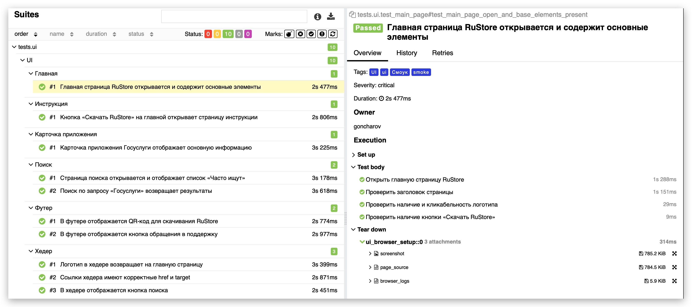
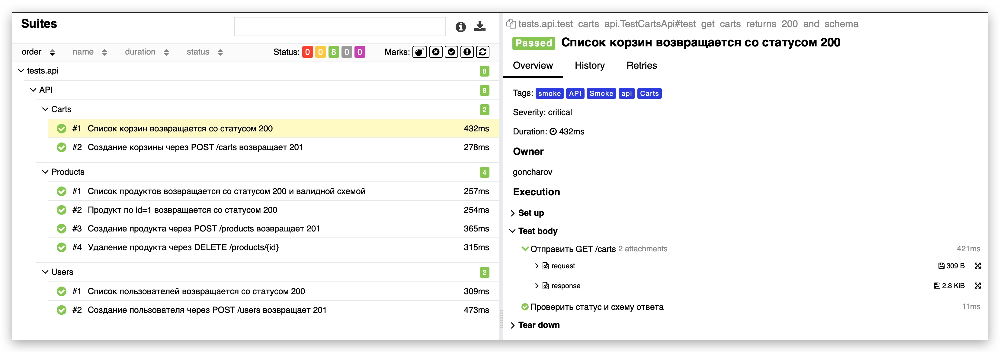
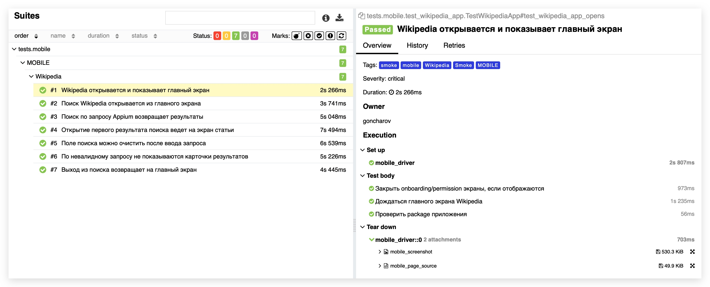

# Дипломный QA проект: UI + API + Mobile Automation

<p align="center">
  
  
  
  
  
  
  
  
  
  
  
  
</p>

<p align="center">
  
  
  
  
</p>

---

## Содержание

- [О проекте](#о-проекте)
- [Технологический стек](#технологический-стек)
- [Покрытие и блоки тестирования](#покрытие-и-блоки-тестирования)
- [Архитектура проекта](#архитектура-проекта)
- [Быстрый старт](#быстрый-старт)
- [Запуск тестов](#запуск-тестов)
- [Отчетность и интеграции](#отчетность-и-интеграции)
- [Сценарий защиты диплома](#сценарий-защиты-диплома)
- [Roadmap](#roadmap)

---

## О проекте

Этот репозиторий объединяет три части дипломной работы по автоматизации тестирования:

1. **UI (Web):** тестирование [RuStore](https://www.rustore.ru/)
2. **API:** тестирование [FakeStore API](https://fakestoreapi.com/docs)
3. **Mobile:** тестирование **Wikipedia APK** через Appium

Проект оформлен как единая QA-система с:
- единым стилем Allure-разметки
- автоприложениями (attachments) в отчетах
- запуском по слоям (`ui`, `api`, `mobile`)
- готовностью к CI/CD и отчетам в TestOps

---

## Технологический стек

- **Python 3.10+**
- **Pytest**
- **Selene + Selenium** (UI)
- **Requests + JSON Schema + Pydantic** (API)
- **Appium + UiAutomator2** (Mobile)
- **Allure Report / Allure TestOps**
- **Jenkins**
- **Jira**
- **Telegram notifications**

---

## Покрытие и блоки тестирования

### UI (Web, RuStore)

- `tests/ui/test_main_page.py`
- `tests/ui/test_header_navigation.py`
- `tests/ui/test_search.py`
- `tests/ui/test_instruction_page.py`
- `tests/ui/test_footer.py`
- `tests/ui/test_app_page.py`

Что проверяется:
- главная страница и базовые элементы
- хедер и навигация
- поиск и результаты
- карточка приложения
- переход на инструкцию скачивания
- элементы футера

### API (FakeStore API)

- `tests/api/test_products_api.py`
- `tests/api/test_users_api.py`
- `tests/api/test_carts_api.py`

Что проверяется:
- методы **GET / POST / DELETE**
- статус-коды
- бизнес-значения в ответе
- schema validation (request/response)
- endpoint-подход с базовым URI из фикстуры

### Mobile (Wikipedia APK)

- `tests/mobile/test_wikipedia_app.py`

Что проверяется:
- запуск приложения
- открытие и работа поиска
- проверка результатов
- доп. пользовательские сценарии в поиске

---

## Архитектура проекта

```text
.
├── api/
│   └── endpoints/                 # Endpoint-классы API
├── config/
│   └── mobile_config.py           # Pydantic-конфиги Mobile (local/remote)
├── media/
│   ├── icons/                     # Иконки для README
│   └── images/                    # Скриншоты отчетов и демонстрации
├── models/
│   └── api/                       # Pydantic request/response модели
├── pages/                         # UI PageObjects
├── resources/
│   └── apk/                       # APK для mobile запуска
├── schemas/
│   └── api/                       # JSON схемы API
├── tests/
│   ├── api/
│   ├── mobile/
│   └── ui/
├── pytest.ini
├── requirements.txt
└── Makefile
```

---

## Быстрый старт

### 1. Установка зависимостей

```bash
python -m venv .venv
source .venv/bin/activate
pip install -r requirements.txt
```

### 2. Проверка качества кода с помощью black, ruff, mypy

```bash
make qa
```

---

## Запуск тестов

### Все тесты сразу

```bash
pytest tests --alluredir=allure-results
```

### Только UI

```bash
pytest tests/ui -m ui --alluredir=allure-results
```

### Только API

```bash
pytest tests/api -m api --alluredir=allure-results
```

### Только Mobile

```bash
pytest tests/mobile -m mobile --alluredir=allure-results
```

### Просмотр Allure-отчета

```bash
allure serve allure-results
```

### Jenkins запуск

В репозитории добавлен `Jenkinsfile` для pipeline запуска с параметрами:

- `TEST_SCOPE`: `ui` / `api` / `ui_api` / `all_no_mobile` / `mobile`
- `UI_BASE_URL`, `UI_BROWSER`
- `API_BASE_URL`, `API_TIMEOUT`
- `SELENOID_URL`, `SELENOID_LOGIN`, `SELENOID_PASS`

Для UI-видео в Allure:

1. Укажи `SELENOID_URL` (host или full URL к `wd/hub`)
2. При необходимости укажи `SELENOID_LOGIN` / `SELENOID_PASS`
3. Убедись, что Selenoid video endpoint доступен (`/video/<session_id>.mp4`)

Тогда в Allure будет:
- `video_<session_id>.html` (встроенный плеер)
- `video_url` (прямая ссылка на mp4)

---

## Параметры окружения

### UI

- `UI_BASE_URL` (default: `https://www.rustore.ru`)
- `UI_BROWSER` (default: `chrome`)
- `UI_BROWSER_WIDTH` (default: `1920`)
- `UI_BROWSER_HEIGHT` (default: `1080`)
- `SELENOID_URL` (опционально, удаленный запуск)

### API

- `API_BASE_URL` (default: `https://fakestoreapi.com`)
- `API_TIMEOUT` (default: `15`)

### Mobile

- `.env.mobile.local` — локальный запуск (эмулятор/реальный девайс)
- `MOBILE_ENV=remote` + `.env.mobile.remote` — запуск через BrowserStack (по необходимости)

---

## Отчетность и интеграции

### Ссылки на артефакты

- **Allure TestOps Dashboard:** [goncharov_final_project](https://allure.autotests.cloud/project/5145/dashboards)
- **Jenkins Job:** [goncharov_final_project](https://jenkins.autotests.cloud/job/goncharov_final_project/)
- **Jira Issue:** [HOMEWORK-1588](https://jira.autotests.cloud/browse/HOMEWORK-1588)

### Allure Report

#### Главная страница отчета

<p align="center">
  
</p>

#### UI результаты

<p align="center">
  
</p>

#### API результаты

<p align="center">
  
</p>

#### Mobile результаты

<p align="center">
  
</p>

### Пример видео прохождения mobile-автотеста

<p align="center">
  
</p>

